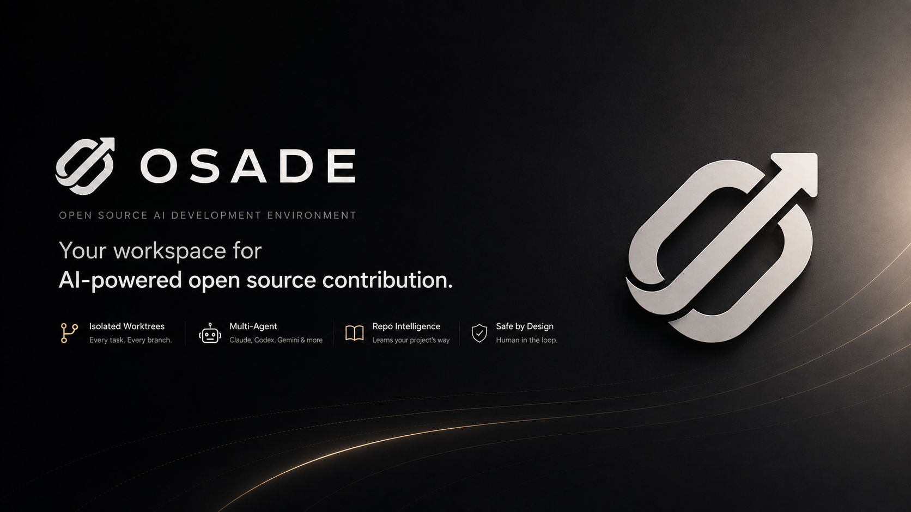

# Osade

> **The development environment for AI-powered open source contribution.**



Osade is a new IDE built for contributing to open source with **multiple coding agents working alongside you**.

Today, contributing to an open-source project with AI often looks like this:

```text
GitHub Issue
    ↓
Open terminal
    ↓
Start Claude / Codex
    ↓
Create a branch
    ↓
Monitor the agent
    ↓
Check what it changed
    ↓
Remember the project's conventions yourself
    ↓
Review everything
    ↓
Create PR
````

When working across multiple issues, repositories, and agents, this quickly becomes difficult to manage.

**Osade is built to make this workflow a first-class experience.**

---

## The idea

Instead of treating an AI agent as a chatbot that edits your repository, Osade treats agents as **workers inside a persistent development environment**.

```text
                         OSADE
                           │
             ┌─────────────┼─────────────┐
             │             │             │
          Worktrees      Agents        Memory
             │             │             │
             └─────────────┼─────────────┘
                           │
                    Open Source Work
                           │
                ┌──────────┴──────────┐
                │                     │
             GitHub               Repository
             Issues                Practices
             PRs                  & Skills
```

You can work across multiple repositories, run multiple agents simultaneously, and keep everything inside one persistent environment.

---

# Core Principles

## 1. Every task gets its own worktree

Agents should never randomly modify your main working directory.

Every task gets an isolated Git worktree.

```text
graphify/
│
├── main/
│
├── worktrees/
│   ├── issue-417/
│   ├── issue-421/
│   └── issue-430/
```

Each worktree can have its own agent, terminal, editor state, tests, and changes.

---

## 2. The repository is the source of truth

Agents can have memory.

But memory is not authority.

Git, the actual codebase, tests, CI, issues, discussions, documentation, and pull requests are always more authoritative than an agent's assumptions.

---

## 3. Agents are workers, not owners

Osade is designed to give agents significant autonomy without giving them unrestricted control.

The human remains responsible for important decisions.

```text
Agent → Understand
Agent → Implement
Agent → Test
Agent → Prepare

Human → Review
Human → Approve
Human → Ship
```

---

## 4. No blind PR creation

An agent shouldn't simply finish coding and immediately open a pull request.

Before contributing, Osade should understand **how that repository expects contributions to happen**.

Some projects may require:

* a discussion before implementation
* a specific issue format
* particular tests
* release notes
* screenshots
* specific commit conventions
* maintainer approval

Osade should account for these practices before an agent ships work.

---

# Repository Intelligence

## 5. Repository practices are learned automatically

Repositories contain a huge amount of knowledge that isn't necessarily written in one place.

Osade can learn from:

* `CONTRIBUTING.md`
* README and documentation
* Git history
* GitHub Issues
* GitHub Discussions
* Pull Requests
* code reviews
* CI failures
* repeated development patterns

The goal is to turn this information into useful, persistent knowledge.

---

## 6. Every repository has its own skills

There is no universal definition of "good contribution."

A workflow that is correct for one repository might be completely wrong for another.

Osade therefore builds **repository-specific skills**.

For example:

```text
Graphify

Repository Skills
├── Discuss major API changes first
├── Prefer existing abstractions
├── Run integration tests
├── Include screenshots for UI changes
└── Keep PRs focused
```

While another repository may have completely different practices.

The agent doesn't need to memorize every repository manually.

**Osade should learn the project's way of working.**

---

# Shared Memory

## 7. Agents share useful knowledge

Multiple agents may work on the same project at the same time.

They shouldn't operate as completely isolated individuals.

If Agent A discovers something important, Agent B should be able to benefit from it.

But Osade shouldn't blindly share entire conversations.

Instead, it should extract durable knowledge:

* facts
* decisions
* discoveries
* failed approaches
* procedures
* architectural knowledge
* repository practices

```text
Agent A
   │
   ▼
Discovery
   │
   ▼
Osade Memory
   │
   ▼
Agent B
```

---

## 8. Memory is layered

Osade's knowledge is organized across different scopes:

```text
Personal
   ↓
Organization
   ↓
Repository
   ↓
Task
   ↓
Agent
```

### Personal

How you prefer to code and contribute.

### Organization

Knowledge shared across related repositories.

### Repository

How a particular project works.

### Task

What has happened while solving a specific issue.

### Agent

The agent's current working context.

---

## 9. Agents learn from other agents

An agent shouldn't have to rediscover something another agent already learned.

```text
Claude
  │
  │ discovers architecture constraint
  ▼
Shared Memory
  │
  ▼
Codex
  │
  └── starts with that knowledge
```

This allows multiple agents to behave more like a **team** rather than independent sessions.

---

# Multi-Repository Development

## 10. Multiple repositories are one workspace

Open-source development rarely happens inside a single repository.

An organization may have:

```text
Organization
│
├── core
├── sdk
├── documentation
├── examples
└── infrastructure
```

A single feature may require changes across several of them.

Osade treats the **organization and its repositories as a connected development environment**, rather than forcing the developer to manage each repository independently.

---

## 11. Multiple agents can work simultaneously

Different agents can work on different tasks and repositories at the same time.

```text
Graphify
│
├── #417 → Claude → worktree-417
├── #421 → Codex  → worktree-421
│
Graphify SDK
│
└── #81  → Claude → worktree-81

Graphify Docs
│
└── #132 → Gemini → worktree-132
```

All of this can exist inside one Osade environment.

---

# Trust & Control

## 12. Every agent action is observable

You should always be able to see:

* what the agent is doing
* what files it changed
* what commands it ran
* what it discovered
* what it learned
* what tests passed or failed
* why it wants to perform an action

There should be no hidden agent state.

---

## 13. Dangerous actions require approval

Osade follows a permission model rather than giving agents unlimited access.

| Action    | Default      |
| --------- | ------------ |
| Read      | Allow        |
| Edit      | Allow        |
| Test      | Allow        |
| Commit    | Configurable |
| Push      | Ask          |
| Create PR | Ask          |
| Merge     | Human only   |

The exact policy can eventually be configured per repository, organization, or user.

---

## 14. Verification before shipping

An agent saying **"I'm done"** does not mean the task is done.

Osade should verify the work through:

* tests
* linting
* type checking
* repository-specific checks
* CI
* diff inspection
* repository contribution rules

The goal is to move from:

```text
Agent says it works
```

to:

```text
Osade verified it works
```

---

# Personal Development Intelligence

## 15. Osade learns how you work

Every developer has their own workflow.

Over time, Osade can learn preferences such as:

```text
Prefer small PRs
Run tests before pushing
Review diffs manually
Use worktrees for parallel tasks
Prefer existing abstractions
Never automatically merge
```

These preferences can be applied across repositories while still respecting each repository's own rules.

---

# Persistent Workspaces

## 16. Workspaces persist

An agent workspace shouldn't disappear when you close the IDE.

Osade should preserve:

* worktrees
* agents
* terminal sessions
* editor state
* layouts
* task state
* memory
* agent progress

Close Osade.

Come back later.

Continue where you left off.

---

## 17. Humans can take over at any point

An agent's workspace is also your workspace.

You can:

```text
Agent working
     ↓
Pause
     ↓
Inspect
     ↓
Modify code yourself
     ↓
Give control back to agent
```

There should never be a hidden layer between you and the code.

---

# Agent Agnostic

## 18. Osade does not have "one Osade model"

Osade is an environment, not a model.

Different agents should be interchangeable:

```text
             OSADE
                │
       ┌────────┼────────┐
       │        │        │
    Claude    Codex    Gemini
       │        │        │
       └────────┼────────┘
                │
             Worktree
```

The architecture should allow different agent runtimes, including future local and open-source agents.

---

# Built on Code-OSS

## 19. Don't reinvent the editor

Osade is intended to build on **Code-OSS**, the open-source foundation behind VS Code.

The goal isn't to spend years rebuilding an editor.

The editor is the foundation.

Osade's focus is everything around it:

```text
Code-OSS
   +
Git Worktrees
   +
Multi-Agent Runtime
   +
Repository Intelligence
   +
Shared Memory
   +
Open Source Workflow
   =
OSADE
```

Osade should remain reasonably close to upstream Code-OSS so that improvements to the underlying editor can continue flowing into the project.

---

# The Osade Loop

The ultimate goal isn't autonomous coding.

It is **trustworthy contribution**.

```text
Understand
    ↓
Isolate
    ↓
Execute
    ↓
Learn
    ↓
Verify
    ↓
Review
    ↓
Ship
    ↓
Remember
    ↺
```

Every contribution makes the environment smarter about the developer, the repository, and the organization.

---

# Vision

We believe the next generation of open-source development won't be:

```text
Human
  ↓
AI writes code
```

It will be:

```text
                    Human
                      │
                      ▼
                  OSADE
                      │
        ┌─────────────┼─────────────┐
        ▼             ▼             ▼
      Agent         Agent         Agent
        │             │             │
     Worktree      Worktree      Worktree
        │             │             │
        └─────────────┼─────────────┘
                      ▼
                Shared Knowledge
                      │
                      ▼
              Tests / Review / CI
                      │
                      ▼
                     PR
```

**Humans decide. Agents execute. Osade coordinates and remembers.**

---

## Status

🚧 **Osade is under active development.**

The project is currently focused on establishing the Code-OSS foundation and experimenting with the architecture for multi-agent, multi-worktree open-source development.

The long-term goal is to make Osade a complete development environment for contributors working with both humans and AI agents.

---

## License

Osade is built on the Code-OSS project.

See the repository's license and attribution files for details.

