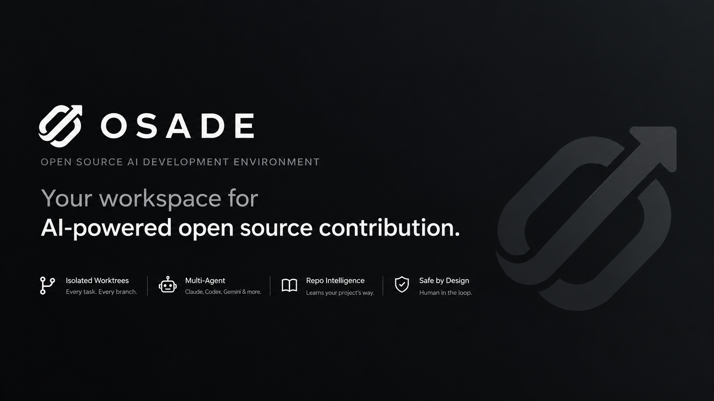

<h1 align="center">Osade</h1>

<p align="center">
  <strong>The open-source Agentic Development Environment.</strong><br>
  Run all your coding agents together on real repositories — from one desktop app.
</p>

<p align="center">
  <a href="LICENSE"></a>
  
  
  
</p>

<p align="center">
  Local-first · Bring your own agent · Nothing leaves your machine without your approval
</p>

<p align="center">
  <a href="#quickstart">Quickstart</a> ·
  <a href="#features">Features</a> ·
  <a href="#supported-agents">Agents</a> ·
  <a href="#architecture">Architecture</a> ·
  <a href="docs/documentation/getting-started.md">Docs</a> ·
  <a href="CONTRIBUTING.md">Contributing</a>
</p>

---

## What is Osade?

An IDE is built around a person editing files. An **ADE** — an Agentic Development Environment — is
built around agents doing the work and a person directing, reviewing and approving it.

Osade is that environment, open source and running entirely on your machine. Open a repository,
type into a chat, and an agent starts working in a terminal you don't have to babysit. Mention a
second agent and it gets its own branch and runs alongside the first. Browse files, read diffs, run
the project's checks and show agents your running app, all in one window. When work is worth
shipping, Osade verifies it, shows you exactly what will happen, and asks before anything leaves
your machine.

It doesn't ship a model, and it doesn't resell one. It drives the agent CLIs you already use and
pay for — Claude Code, Codex, OpenCode, Pi — and recognises dozens more when you run them yourself.

## Quickstart

### Requirements

- **Node.js 22+**
- **pnpm** (`corepack enable`)
- **git**
- At least one agent CLI on your `PATH`: `claude`, `codex`, `opencode` or `pi`

### Run from source

```bash
git clone https://github.com/OsadeOSS/Osade.git
cd Osade
pnpm install
node scripts/fetch-substrate-binaries.mjs   # fetches the pinned terminal substrate
pnpm --filter @osade/desktop start
```

The window opens. Open a folder, type something, press Enter.

### Add the `osade` command

Put `osade` on your `PATH` from this checkout (Windows and POSIX):

```bash
node scripts/install-cli.mjs
```

Open a new terminal, `cd` into any repo, and run `osade .` — the window opens (or comes to the
front) on that repository, the way `code .` does.

### Windows desktop shortcut

After a successful start, so that `apps/desktop/dist` exists:

```powershell
powershell -File scripts/install-desktop-shortcut.ps1
```

This launches the checkout, not a packaged installer.

### Good to know

- **Platforms:** macOS, Linux and Windows.
- **State:** everything Osade writes lives in `~/.osade` (`%USERPROFILE%\.osade` on Windows).
  Delete it to reset completely.
- **GitHub is optional.** Local chat, files, diffs, notes and verification work without signing
  in. Run `gh auth login` first and Osade reuses that login for issues and pull requests instead
  of asking you to authorize a second OAuth app; a device flow and tokens work too.

## Your first session

1. Press **`Ctrl+T`** (`Cmd+T` on macOS) and pick an installed agent.
2. Describe the outcome you want and press **Enter**. The branch name and chat title come from what
   you wrote.
3. Watch the transcript, or open **Files**, **Checks** and **Changes** in the side panel while the
   agent works. The composer stays live, and follow-ups queue until the agent is ready.
4. When you're happy, open a pull request from **Changes**. Osade shows you the exact payload and
   waits for you to approve it.

## Features

### Agents and conversations

- **Talk to an agent instead of configuring a task.** A new chat is an empty box. Type, and the
  agent starts.
- **Run several agents in one conversation.** `@claude` and `@codex` on separate lines fan out to
  two agents, each on its own branch, sharing one transcript. Filter by lane, or read them all
  together. Each agent gets a short digest of what the others are doing.
- **Follow-ups never clobber a running agent.** Messages sent mid-turn are queued and delivered
  when the lane is ready.
- **Images and extra repositories as context.** Paste up to eight screenshots into a message, or
  attach other local repositories read-only.
- **Plan first.** A repository-level **Plan** conversation for coordinating before anyone writes
  code.

### Branches and worktrees

- **Stay on your real checkout by default.** The first chat in a repo attaches to your working tree
  on whatever branch is already checked out — no surprise branch, no worktree you didn't ask for.
- **Branch out when you're ready** with `/branch`, bringing uncommitted changes with you.
- **Isolation is automatic.** Additional chats and extra agents get their own git worktrees, so two
  agents never write to the same tree.
- **Pick up review feedback on the PR's own branch** instead of opening a second pull request.

### Workspace and review

- **Files, Checks, Changes, Rules and Notes** sit beside the chat. Edit and save files, preview
  Markdown, and read unified diffs split into working-tree changes and unpushed commits.
- **Ask about what you're looking at.** The composer attaches the open file, selected lines, the
  current diff hunk or a failing check's log — so "why did you change this" works while you're
  reading the hunk.
- **A Kanban board for every session** — *Needs you*, *Working*, *Failed*, *In review*, *Ready to
  merge* — derived from what's actually happening, never from a stale status flag.
- **Command center** (`Ctrl+K`) for every action and every conversation.

### Real terminals, built in

- **Terminal tabs** for PowerShell, CMD, Git Bash or your `$SHELL`, rendered on the GPU with
  truecolor, Unicode 11 widths and 10,000 lines of scrollback.
- **Agents survive the window.** Shells and agents run in the Osade daemon, so closing the app
  doesn't kill an agent mid-task. Tabs come back, with their output, when you reopen.
- **Agents you start yourself are tracked too.** Run `claude`, `gemini`, `aider` or any of 30+
  agents in a terminal tab and Osade lists it in the sidebar with a live *Working* / *Done* state.

### Show, don't describe

- **Browser view** (`Ctrl+Shift+B`) keeps your running app beside the chat. Take a screenshot,
  click the element you mean, and the next message carries the annotated capture plus the page URL
  and element name. The agent opens the right file and looks at it.
- The pane is isolated in its own `WebContentsView` — no preload bridge, no Node.js, its own cookie
  jar, `http` and `https` only.

### Verification and publishing

- **Checks inferred from evidence.** Osade reads CI workflows, manifests and project docs to
  propose a verification plan, citing where each command came from. You review it before it ever
  runs.
- **Results are tied to the commit.** An old failure never blocks a new revision, and a failing
  required check blocks a pull request.
- **Every outward action is gated.** Commits, pushes, forks, pull requests and comments stop at an
  approval card showing the exact payload. Approve, deny, or edit and approve. The approval is
  bound to those bytes — if the action changes, it won't run.
- **Osade never merges.** Ever.

### Durable context

- **Repository rules** in `.osade/rules.md`, injected into every agent at launch.
- **Quick notes** (`Ctrl+Shift+N`) pinned to a file and line, included with every message until you
  resolve them.

## Supported agents

**Launched and managed by Osade** — Osade starts these in chats, gives each its own lane and branch,
and checks that the command is on your `PATH`:

| Agent | Command |
| --- | --- |
| Claude Code | `claude` |
| Codex | `codex` |
| OpenCode | `opencode` |
| Pi | `pi` |

**Detected in terminal tabs** — start any of these yourself and Osade shows it in the sidebar:
Claude Code, Codex, Gemini, Antigravity, OpenCode, Cline, Kiro, Freebuff, Codebuff, Aider, Goose,
Amp, Kilo Code, Crush, Auggie, GitHub Copilot, Cursor, Droid, Qwen Code, Kimi, Mistral Vibe,
Continue, Hermes, OpenClaw, Grok, Devin, Qoder, CodeBuddy, OpenClaude, Pi, Trae, Autohand,
Command Code, MiMo Code, ZCode and Jcode.

Adding an agent is a catalog entry plus a detection manifest — no orchestration changes. See
[Contributing](#contributing).

## Architecture

Three processes. Two of them keep running when you close the window, so agents don't die with the
app.

```text
Electron app        chats, lanes, files, diffs, checks, gates, terminals, browser view
      │  tRPC + WebSocket, 127.0.0.1 only
Osade daemon        chats, lanes, verification, gates, GitHub, conventions
      │             SQLite + change_log + CDC
      │  JSON API over a local socket
terminal substrate  PTYs, worktrees, agent detection, session persistence
```

Osade doesn't reimplement terminals. A headless substrate owns PTYs, VT parsing, git worktrees and
agent process detection; Osade drives it over a JSON API generated from a pinned schema.

Two invariants are worth knowing if you read the code:

- **No `status` column.** Task status is a pure function over durable facts — what the substrate
  observed, what verification returned, what GitHub reported — recomputed on every read. A flaky
  probe can't kill a live agent.
- **One event path.** Every change reaches the UI through a SQLite trigger into `change_log`. If the
  UI didn't update, the write didn't go through the database.

### Repository layout

```text
apps/desktop        Electron + React desktop app
packages/daemon     the Osade daemon: domain, database, substrate client, SCM, server
packages/contract   types shared between the app and the daemon
packages/cli        the `osade` command
backend/            terminal substrate source (reference only — never hand-edited)
vendor/runtime      pinned substrate schema and binaries
docs/documentation  public user documentation
docs/               specs and architecture notes
```

The full picture is in [docs/architecture.md](docs/architecture.md).

## Privacy and security

- **Local-first.** The daemon listens on `127.0.0.1` only. Your code, transcripts and state stay in
  `~/.osade` and your repositories.
- **Bring your own agent.** Your agents talk to their providers exactly as they do outside Osade.
  The one optional exception is convention mining, which calls the Anthropic API only if you set
  `OSADE_ANTHROPIC_API_KEY` yourself. The key is read from the environment and never written to
  disk.
- **Credentials stay on your machine** and are used only for GitHub actions you request and approve.
- **Human gates** sit in front of every action published under your identity.

Found a vulnerability? Please report it privately — see [SECURITY.md](SECURITY.md).

## Why it works this way

Open source is closing the door on autonomous AI contributions. Godot banned autonomous agent use.
curl shut down its bug bounty. Maintainers report roughly 1 in 10 AI PRs meets their bar.

The bottleneck is review capacity, not code production — so a tool that produces more agent PRs
makes things worse. Osade optimizes for the opposite: **reduce the review cost of a contribution
until an agent-assisted PR is cheaper to review than a human one.** That's why verification,
evidence-cited conventions and human gates are core rather than optional, and why the highest-value
thing an agent can do is often triage that produces no PR at all — reproduce a bug, bisect a
regression, write a failing test.

The long version is in [docs/OSADE.md](docs/OSADE.md).

## Development

```bash
pnpm install
pnpm --filter @osade/desktop start   # run the app
pnpm test                            # unit tests (vitest)
pnpm lint                            # eslint
pnpm typecheck                       # TypeScript across all packages
pnpm check                           # everything CI runs: codegen drift, attribution, lint, types, tests
pnpm package:dir                     # build an unpacked desktop app with electron-builder
```

Read [CONTRIBUTING.md](CONTRIBUTING.md) before opening a PR — a few project rules (no `status`
column, one event path, gated public writes, never editing `backend/`) are enforced regardless of
how good the code is.

## Documentation

| Guide | What's in it |
| --- | --- |
| [Getting started](docs/documentation/getting-started.md) | Install, open a repo, start your first session |
| [Agents and conversations](docs/documentation/agents-and-conversations.md) | Lanes, multi-agent chats, terminal tabs, detected agents |
| [Branches and worktrees](docs/documentation/branches-and-worktrees.md) | When Osade uses your checkout and when it isolates work |
| [Workspace and review](docs/documentation/workspace-and-review.md) | Sidebar, side panel, Kanban, command center |
| [Verification and publishing](docs/documentation/verification-and-publishing.md) | Checks, diffs, pull requests, approval gates |
| [Browser view](docs/documentation/browser-view.md) | Live pages and annotated screenshots |
| [Notes, rules, and context](docs/documentation/notes-rules-and-context.md) | Durable repository knowledge |
| [Keyboard shortcuts](docs/documentation/keyboard-shortcuts.md) | Every shortcut in one table |

For contributors: [docs/architecture.md](docs/architecture.md) covers processes, boundaries and
invariants in depth, and [docs/OSADE.md](docs/OSADE.md) is the full spec.

## Status

Early and moving fast. Usable, not stable. There is no packaged release yet — run from source as
shown above. Expect rough edges, and please file issues when you hit them.

## Contributing

Issues and PRs are welcome. Good places to start:

- **Add an agent.** It's a catalog entry plus a detection manifest — no orchestration changes.
  Behaviour branches on declared capabilities (`plan-mode`, `resume`, `hook-reporting`,
  `headless-run`), never on which agent it is.
- **Improve the docs.** `docs/documentation/` is the source of truth for the documentation site;
  user-facing changes update it in the same PR.
- **Report what broke.** A clear reproduction is one of the most useful contributions there is.

See [CONTRIBUTING.md](CONTRIBUTING.md) for the workflow and project rules.

## License

Apache-2.0. See [LICENSE](LICENSE) and [NOTICE](NOTICE); third-party attributions are in
[THIRD-PARTY-NOTICES.md](THIRD-PARTY-NOTICES.md).
